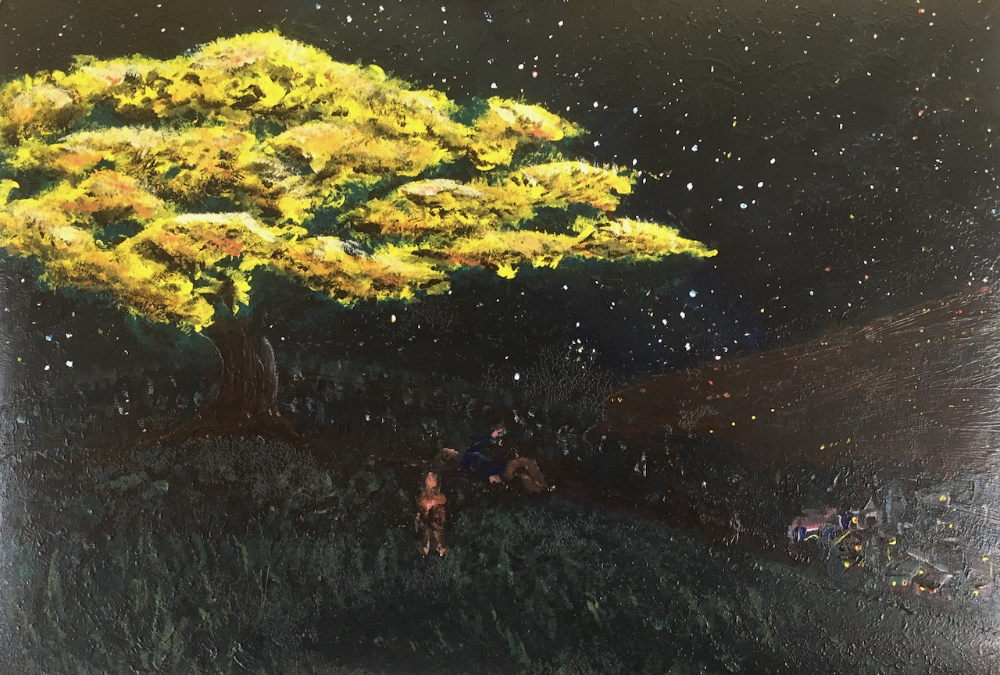
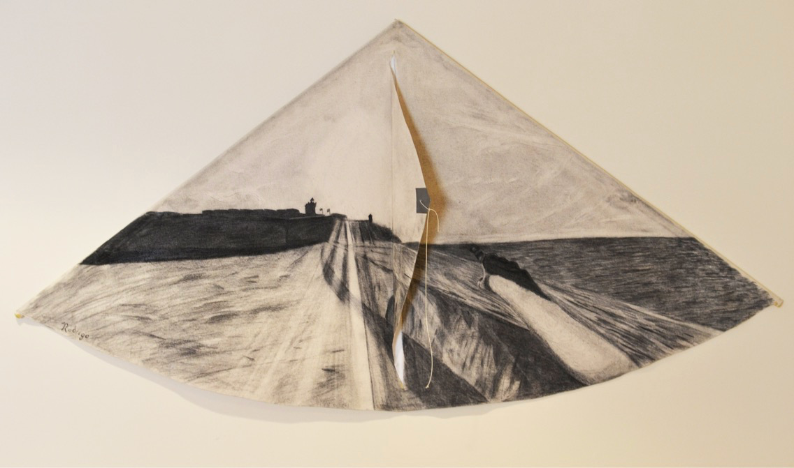

Visual arts have been a passion of mine as long as I can rememeber. From oil paiting to photography, I love to capture a moment in time, space, and imagination. Below you can see some of this work. 

<body>

    

        
    

<!-- Photo Grid -->

  

  
  

    

  

  
  
  
  

    

        
    

    

        
    

<!-- Photo Grid -->

  

  
    

  

  
  
  

    

        
    

    

        
    

Please do not reproduce these images without attribution. All rights reserved, Rodrigo Córdova Rosado, 2024. 