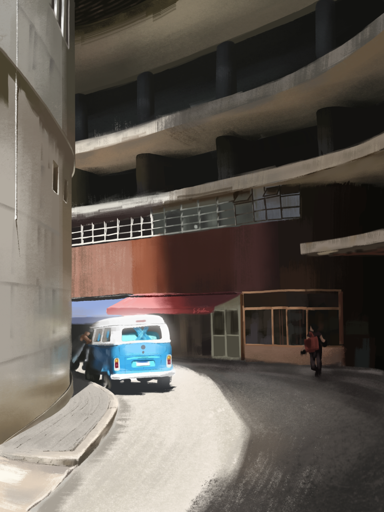
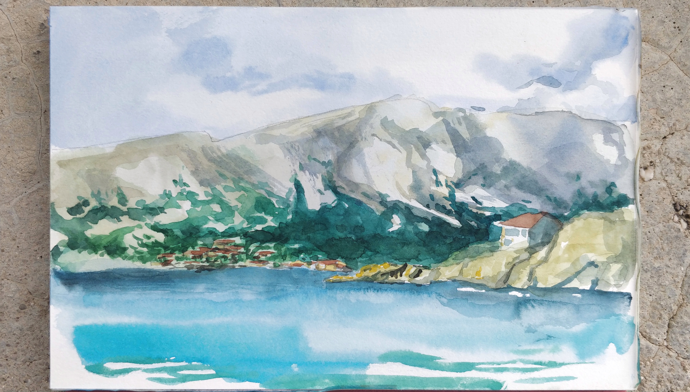
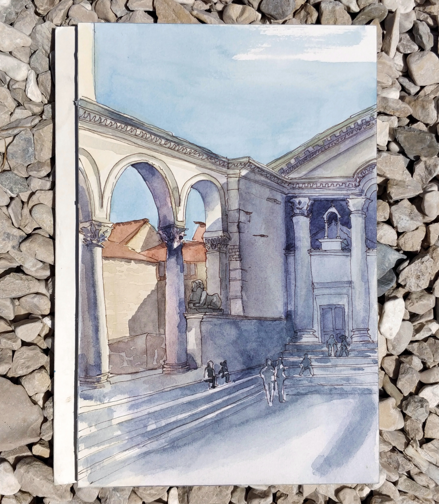
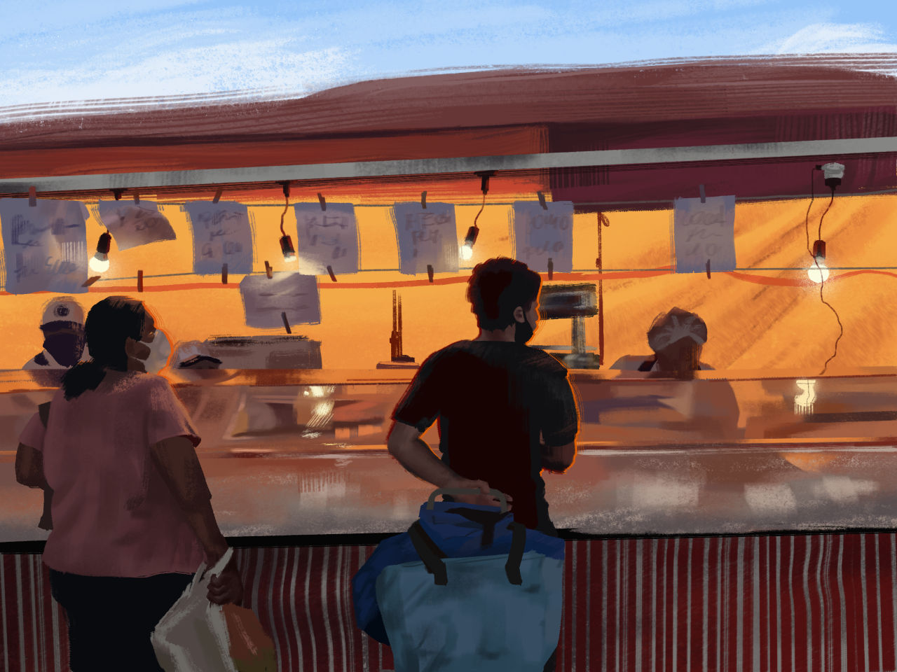

<!-- Drawing has been my long-standing hobby ever since I started doodling on the margins of my notebooks as a kid. I've been struggling against watercolor for a few years and recently started learning oil painting and dabbling in digital painting. I've been completely self-taught until fairly recently, when I began attending classes during the weekend at a small art school in Baltimore. Below you can see some of my paintings in the three aforementioned media!
 -->

<body>

    

        
    

<!-- Photo Grid -->

  

  
  

    

  

  
  
  
  

    

        
    

